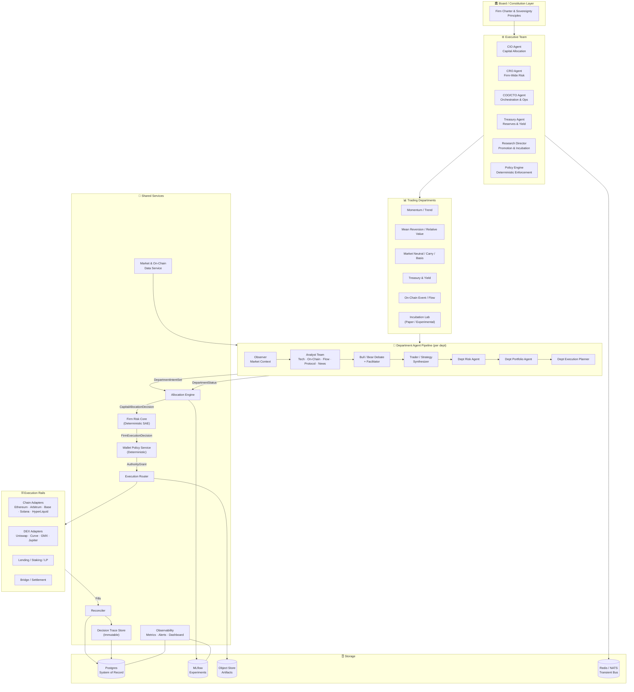

<p align="center">
  
</p>

<h1 align="center">Crewless Capital</h1>

<p align="center">
  <em>Autonomous crypto markets, self-custodied and sovereign.</em>
</p>

<p align="center">
  
  
  
  
  
</p>

---

## Overview

**Crewless Capital** is an autonomous, self-custodied, DEX-native crypto investment firm. It is structured as a **multi-department AI trading firm** modeled on institutional investment management principles — with an executive allocation layer, independent trading departments, deterministic safety enforcement, and modular on-chain execution rails.

The firm operates exclusively across decentralized exchanges, on-chain protocols, and blockchain-native infrastructure. Custodial exchange integrations are excluded by design. All capital remains under self-custodied control at all times.

### Constitutional Principles

1. **Self-custody and sovereignty first** — private keys never leave operator control; no third-party custodians.
2. **DEX and on-chain only** — no custodial CEX integrations, ever.
3. **Department autonomy, not capital sovereignty** — departments propose; only the Executive Layer allocates capital.
4. **Typed artifacts at every handoff** — no untyped prompt chains cross service boundaries.
5. **Deterministic safety before execution** — policy and wallet authority gates are non-bypassable.
6. **Adaptation off the hot path** — strategy changes only through versioned promotion gates.
7. **No-trade is a first-class outcome** — idle or defensive posture is valid and measurable.
8. **Full auditability** — every decision, allocation, and execution is logged to an immutable trace.

---

## Architecture Overview



---

## System Components

### Executive Team

| Agent | Role |
|---|---|
| **CIO Agent** | Scores departments and issues `CapitalAllocationDecision` each cycle |
| **CRO Agent** | Enforces firm-wide exposure caps, concentration limits, drawdown throttles |
| **COO/CTO Agent** | Orchestrates service lifecycle, halts, recovery, and degraded-mode routing |
| **Treasury Agent** | Manages reserve sweeps, stablecoin ladders, and idle capital yield deployment |
| **Research Director** | Routes incubated strategies through validation tiers toward live promotion |
| **Policy Engine** | Deterministic constitutional enforcement — no LLM, non-bypassable |

### Trading Departments

Each department implements a standardized internal agent pipeline and publishes a `DepartmentStatus` and `DepartmentIntentSet` every cycle. Capital is allocated, throttled, or revoked by the Executive Layer based on performance, regime fit, and strategic priority.

| Department | Regime | Mandate |
|---|---|---|
| Momentum / Trend | Trending, high-participation | Directional spot, perps, momentum rotations |
| Mean Reversion / Relative Value | Range-bound, overextended | Countertrend entries, dislocation fades |
| Market Neutral / Carry / Basis | Funding / basis dislocations | Delta-neutral carry, basis capture, hedged yield |
| Treasury & Yield | Defensive / low-opportunity | Stable ladders, lending, staking |
| On-Chain Event / Flow | Governance, vesting, liquidity migration | Event-driven positioning |
| Incubation Lab | Research / paper | No live capital; simulation and validation only |

### Department Funding States

```
UNFUNDED → PAPER_ONLY → SHADOW_ALLOCATED → LIMITED_CAPITAL → FULL_CAPITAL
                                                    ↕                  ↕
                                               THROTTLED          THROTTLED
                                                    ↓                  ↓
                                               PAUSED → SUNSETTING
```

---

## Repository Structure

```
crewless-capital/
├── README.md
├── SPEC.md                          ← Full v2 architecture specification
├── DEVELOPMENTPLAN.md               ← Phased build plan with exit gates
├── LICENSE
├── Makefile
├── docker-compose.yml
├── docker-compose.paper.yml
├── docker-compose.live.yml
├── .env.example
│
├── proto/                           ← Protobuf contract definitions
│   ├── common.proto
│   ├── market.proto
│   ├── department.proto
│   ├── allocation.proto
│   ├── risk.proto
│   ├── wallet.proto
│   ├── execution.proto
│   ├── treasury.proto
│   ├── governance.proto
│   └── research.proto
│
├── apps/                            ← Backend services
│   ├── orchestrator-api/            ← Cycle coordinator, control plane, event bus (TypeScript)
│   ├── allocation-engine/           ← Executive scoring and budget routing (Python)
│   ├── firm-risk-core/              ← Global risk, policy, deterministic SAE (TypeScript)
│   ├── wallet-policy-service/       ← Wallet authority and signer routing (TypeScript)
│   ├── execution-router/            ← Routes execution plans to adapters (Python)
│   ├── treasury-service/            ← Reserve, stable, yield, settlement (Python)
│   ├── reconciler/                  ← Portfolio state and fill reconciliation (Python)
│   ├── research-bridge/             ← Market/on-chain data ingestion, analysts (Python)
│   ├── optimizer-jobs/              ← Off-path performance analysis and promotion (Python)
│   └── dashboard/                   ← Traces, approvals, allocations, governance (Next.js)
│
├── departments/                     ← Trading department modules
│   ├── runtime-host/                ← Generic department agent pipeline host
│   ├── momentum/
│   │   ├── README.md
│   │   ├── mandate.yaml
│   │   ├── analysts/
│   │   ├── debate/
│   │   ├── trader/
│   │   ├── risk/
│   │   ├── portfolio/
│   │   ├── strategy/
│   │   └── tests/
│   ├── mean-reversion/
│   ├── market-neutral/
│   ├── treasury-yield/
│   ├── onchain-event/
│   └── incubation/
│
├── adapters/                        ← Chain and protocol execution adapters
│   ├── chains/
│   │   ├── ethereum/
│   │   ├── arbitrum/
│   │   ├── base/
│   │   ├── solana/
│   │   └── hyperliquid/             ← HyperLiquid as one rail among many
│   ├── dex/
│   │   ├── uniswap-v3/
│   │   ├── uniswap-v4/
│   │   ├── curve/
│   │   ├── gmx/
│   │   └── jupiter/
│   ├── lending/
│   ├── staking/
│   └── bridges/
│
├── packages/                        ← Shared libraries and policy definitions
│   ├── schemas/                     ← Generated JSON schemas from proto
│   ├── prompt-policies/             ← Versioned prompt templates (off-path only)
│   ├── strategy-sdk/                ← Plugin API for department strategy modules
│   ├── wallet-policies/             ← Wallet authority rule definitions
│   ├── governance-rules/            ← HITL and promotion rulesets
│   └── model-routing/               ← LLM model routing tables per task
│
├── config/                          ← Runtime configuration
│   ├── env/
│   ├── policies/                    ← Firm policy YAML files
│   ├── departments/                 ← Per-department configuration
│   ├── mandates/                    ← Investment mandate definitions
│   ├── chains/                      ← Chain configuration and metadata
│   ├── protocols/                   ← Protocol allowlist and metadata
│   └── wallets/                     ← Wallet class and authority definitions
│
├── infra/                           ← Infrastructure as code
│   ├── k8s/
│   ├── argocd/
│   ├── terraform/
│   └── observability/               ← Prometheus, Grafana, Loki configs
│
├── docs/                            ← Documentation
│   ├── architecture.md
│   ├── api-contracts.md
│   ├── protobuf.md
│   ├── department-guide.md
│   ├── wallet-authority.md
│   └── runbooks/
│
└── tests/
    ├── contract/                    ← Proto/schema contract tests
    ├── integration/                 ← Service-to-service integration tests
    ├── simulation/                  ← Paper trade simulation tests
    └── chaos/                       ← Fault injection and recovery tests
```

---

## Key Technical Decisions

| Decision | Choice | Rationale |
|---|---|---|
| Custody model | Self-custodied wallets / smart accounts | Constitutional invariant — no third-party custody |
| Venue scope | DEX and on-chain only | Sovereignty and censorship resistance |
| Agent outputs | Typed protobuf/JSON artifacts | Prevents untyped prompt-chain execution authority |
| Safety enforcement | Deterministic rule engines (no LLM) | Non-bypassable; auditable; reproducible |
| Adaptation path | Off-path via versioned promotion gates | Live behavior cannot be mutated mid-session |
| Execution authority | Wallet policy service + signer grants | Bounded by dept, chain, protocol, daily limit |
| Observability | Immutable DecisionTrace per cycle | Full replayability of every decision |
| Orchestration language | TypeScript (orchestrator, risk, wallet policy) | Strict API discipline, lower operational ambiguity |
| Agent/strategy language | Python | TradingAgents framework compatibility, ecosystem |

---

## Project Status

> ⚠️ **This project is in active research and development.**
> All strategies are hypotheses to be validated through rigorous backtesting, paper trading, and staged deployment before any live capital is deployed.
> Nothing in this repository constitutes investment advice.

### Roadmap

- [ ] `SPEC.md` v2 — multi-department architecture specification ✅
- [ ] `DEVELOPMENTPLAN.md` — phased build plan with exit gates
- [ ] Proto contract scaffolding
- [ ] Department mandate definitions
- [ ] Orchestrator API scaffold
- [ ] Market data ingestion layer
- [ ] Department runtime host
- [ ] Research packet pipeline
- [ ] Bull/bear debate framework
- [ ] Allocation engine (rules-based v1)
- [ ] Firm risk core / policy engine
- [ ] Wallet policy service
- [ ] Paper trading harness
- [ ] Backtest and evaluation framework
- [ ] Dashboard (traces + allocation views)
- [ ] Treasury service
- [ ] Execution router + DEX adapters
- [ ] Reconciler
- [ ] Production deployment (staged, limited capital)

---

## Documentation

| Document | Description |
|---|---|
| [`SPEC.md`](SPEC.md) | Full v2 system specification — architecture, contracts, org structure |
| [`DEVELOPMENTPLAN.md`](DEVELOPMENTPLAN.md) | Phased implementation plan with exit gates |
| [`docs/architecture.md`](docs/architecture.md) | Detailed architecture notes |
| [`docs/wallet-authority.md`](docs/wallet-authority.md) | Wallet authority model and grant lifecycle |
| [`docs/department-guide.md`](docs/department-guide.md) | How to build and onboard a new department |
| [`docs/runbooks/`](docs/runbooks/) | Operational runbooks |

---

## License

MIT — see [LICENSE](LICENSE) for details.

---

<p align="center">
  <em>Built by machines. Governed by code. Owned by no one but the keyholder.</em>
</p>
