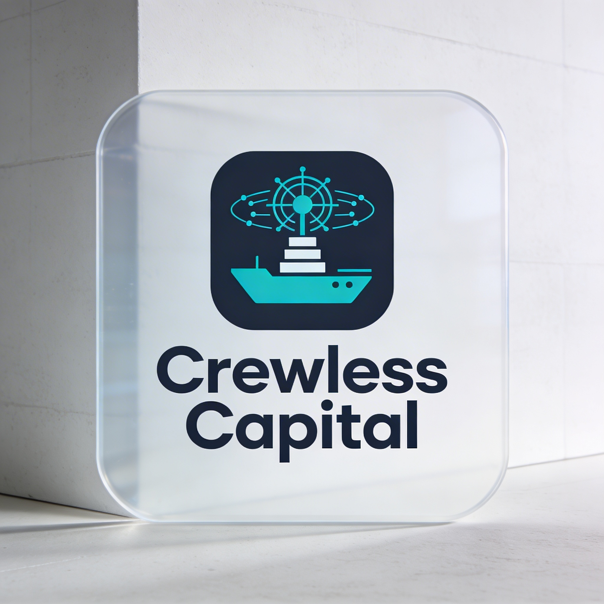

<p align="center">
  
</p>

<h1 align="center">Crewless Capital</h1>

<p align="center">
  <em>Autonomous crypto markets, self-custodied and sovereign.</em>
</p>

<p align="center">
  
  
  
</p>

---

## Overview

**Crewless Capital** is an autonomous, self-custodied crypto trading project that treats capital as sovereign and infrastructure as code. It operates as a zero-human firm, delegating all market research, risk management, and execution to AI agents that trade across centralized venues, DEXs, and staking protocols — while preserving full on-chain ownership and custody control at all times.

At its core, Crewless Capital is powered by the **NullStack Trading Firm**: a fully automated AI trading stack that ingests market and on-chain data, runs modular trading agents, and routes orders across spot, perpetuals, and DeFi liquidity venues. Designed as a crewless firm-within-a-firm, NullStack enforces strict risk limits, self-custody policies, and end-to-end auditability — operating entirely without human discretion in the execution loop.

---

## Key Features

### 🤖 Zero-Human Autonomous Execution
- All trading decisions, order routing, and position management are handled exclusively by AI agents.
- No human discretion in the execution path; agents operate within defined risk and policy boundaries.
- Configurable kill switches, circuit breakers, and exposure caps enforced at the system level.

### 🔐 Self-Custody & Sovereign Holdings
- Non-custodial by design — private keys never leave the operator's custody.
- All positions and treasury assets held in self-custodied wallets and on-chain vaults.
- No delegation of custody to third-party custodians, exchanges, or counterparties.

### 🌐 Multi-Venue Execution
- Unified execution across centralized exchanges (CEX), decentralized exchanges (DEX), and on-chain protocols.
- Supports spot, perpetuals, and options across multiple venue types.
- Intelligent order routing and slippage management per venue.

### 📈 DeFi & DEX Native
- Deep integration with DeFi protocols: liquidity provision, yield optimization, and tokenized asset strategies.
- On-chain signal ingestion from DEX order flow, mempool data, and protocol metrics.
- Support for AMM-based and order-book DEXs.

### 🪙 Staking & Tokenized Assets
- Native support for staking, restaking, and liquid staking derivative (LSD) strategies.
- Portfolio exposure to tokenized real-world assets (RWAs) and on-chain structured products.
- Yield-bearing position management across proof-of-stake networks.

### 🧠 Modular AI Agent Architecture (NullStack Trading Firm)
- Multi-agent system with isolated, purpose-built agents for each domain:
  - **Market Research Agent** — macro context, narrative rotation, liquidity regime detection
  - **Strategy Agent** — signal generation, entry/exit logic, strategy selection
  - **Risk Engine Agent** — position sizing, drawdown controls, exposure caps
  - **Execution Agent** — order routing, slippage management, retry/idempotency
  - **Treasury Agent** — stablecoin conversion, yield deployment, cash management
  - **Monitoring Agent** — heartbeat checks, anomaly detection, alerting
- Agents communicate via an event-driven internal bus with immutable audit logs.

### 🛡️ Risk Controls & Safety
- Per-agent and system-wide position limits, leverage caps, and max drawdown thresholds.
- Circuit breakers that halt execution on anomalous market conditions or data feed failures.
- All decisions and signals are logged to an immutable audit trail.

### 🔍 Observability & Auditability
- Full event log of every agent decision, signal, and order action.
- Real-time metrics, dashboards, and alerting for all system components.
- Reconciliation jobs to detect and correct state drift between internal ledger and exchange/chain state.

### 🔒 Security Model
- Least-privilege API keys: read-only keys for research and data, restricted trading keys for execution.
- Secrets managed via a dedicated secrets manager — no hardcoded credentials.
- Strict environment separation: research / paper-trading / staging / production.

---

## Architecture Overview

```
┌──────────────────────────────────────────────────────────┐
│                    Crewless Capital                      │
│          (Sovereign, Self-Custodied AI Trading Firm)     │
└───────────────────────┬──────────────────────────────────┘
                        │
          ┌─────────────▼──────────────┐
          │   NullStack Trading Firm   │
          │  (Autonomous Execution     │
          │       Engine)              │
          └─────────────┬──────────────┘
                        │
   ┌────────────────────┼─────────────────────┐
   │                    │                     │
   ▼                    ▼                     ▼
Data Ingestion     Agent Layer           Execution Layer
─────────────      ──────────────        ───────────────
Market Data        Market Research       CEX APIs
On-chain Data      Strategy Agent        DEX Protocols
DEX Order Flow     Risk Engine           Staking Rails
Protocol Metrics   Treasury Agent        DeFi Vaults
                   Monitoring Agent
                        │
                        ▼
                 Risk & Safety Layer
                 ────────────────────
                 Circuit Breakers
                 Kill Switches
                 Exposure Caps
                 Audit Log
```

---

## Project Status

> ⚠️ **This project is in active research and development.**
> All strategies are hypotheses to be validated through rigorous backtesting, paper trading, and staged deployment before any live capital is deployed.
> Nothing in this repository constitutes investment advice.

---

## Roadmap

- [ ] Core agent architecture scaffold (NullStack Trading Firm)
- [ ] Data ingestion layer (market data, on-chain feeds)
- [ ] Strategy research framework and backtesting harness
- [ ] Paper trading environment
- [ ] Risk engine and circuit breaker implementation
- [ ] CEX execution integration
- [ ] DEX / DeFi execution integration
- [ ] Staking and yield management module
- [ ] Self-custody treasury management system
- [ ] Full observability stack
- [ ] Production deployment (staged)

---

## License

MIT — see [LICENSE](LICENSE) for details.

---

<p align="center">
  <em>Built by machines. Governed by code. Owned by no one but the keyholder.</em>
</p>
